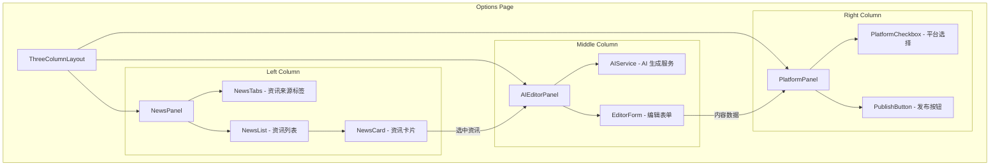

# Design Document

## Overview

本设计将现有的 Options 页面从两栏布局改造为三栏布局，新增资讯选择区域（左栏）和 AI 内容生成编辑区域（中栏），保留现有的发布平台选择区域（右栏）。

核心改造点：
1. 新增 `NewsPanel` 组件 - 资讯来源选择和展示
2. 新增 `AIEditorPanel` 组件 - AI 内容生成和编辑
3. 重构 `PlatformPanel` 组件 - 从现有 Tab 组件中提取平台选择逻辑
4. 新增 `ThreeColumnLayout` 布局组件 - 统一管理三栏布局和数据流

## Architecture



## Components and Interfaces

### 1. ThreeColumnLayout 组件

主布局组件，管理三栏之间的数据流和状态。

```typescript
interface ThreeColumnLayoutProps {
  publishType: 'dynamic' | 'article' | 'video';
}

interface LayoutState {
  selectedNews: NewsItem | null;
  editorContent: EditorContent;
  selectedPlatforms: string[];
  isAIGenerating: boolean;
}
```

### 2. NewsPanel 组件

左侧资讯选择区域。

```typescript
interface NewsPanelProps {
  onNewsSelect: (news: NewsItem, publishType: PublishType) => void;
  selectedNewsId: string | null;
}

interface NewsItem {
  id: string;
  title: string;
  summary: string;
  author: string;
  source: NewsSource;
  publishTime: string;
  recommendScore: number;
  coverImage?: string;
  originalUrl: string;
}

type NewsSource = 'weixin' | 'xiaohongshu' | 'zhihu' | 'douyin';
type PublishType = 'dynamic' | 'article' | 'video';
```

### 3. NewsCard 组件

资讯卡片展示组件。

```typescript
interface NewsCardProps {
  news: NewsItem;
  isSelected: boolean;
  onSelect: (news: NewsItem) => void;
  onPublishTypeSelect: (news: NewsItem, type: PublishType) => void;
}
```

### 4. AIEditorPanel 组件

中间 AI 编辑区域。

```typescript
interface AIEditorPanelProps {
  selectedNews: NewsItem | null;
  publishType: PublishType;
  onContentChange: (content: EditorContent) => void;
  initialContent?: EditorContent;
}

interface EditorContent {
  title: string;
  content: string;
  digest: string;
  coverImage: FileData | null;
  images: FileData[];
  videos: FileData[];
}

interface AIGenerationRequest {
  newsItem: NewsItem;
  publishType: PublishType;
  targetPlatforms?: string[];
}

interface AIGenerationResponse {
  title: string;
  content: string;
  digest: string;
  suggestedTags?: string[];
}
```

### 5. PlatformPanel 组件

右侧平台选择区域（从现有组件重构）。

```typescript
interface PlatformPanelProps {
  publishType: PublishType;
  content: EditorContent;
  onPublish: (data: SyncData) => void;
  selectedPlatforms: string[];
  onPlatformChange: (platforms: string[]) => void;
}
```

### 6. AIService 服务

AI 内容生成服务接口。

```typescript
interface AIService {
  generateContent(request: AIGenerationRequest): Promise<AIGenerationResponse>;
  isAvailable(): Promise<boolean>;
}
```

## Data Models

### NewsItem 数据模型

```typescript
interface NewsItem {
  id: string;                    // 唯一标识
  title: string;                 // 标题
  summary: string;               // 内容摘要
  author: string;                // 作者
  source: NewsSource;            // 来源平台
  publishTime: string;           // 发布时间（ISO 格式）
  recommendScore: number;        // 推荐指数（0-100）
  coverImage?: string;           // 封面图 URL
  originalUrl: string;           // 原文链接
  tags?: string[];               // 标签
}
```

### EditorContent 数据模型

```typescript
interface EditorContent {
  title: string;                 // 标题
  content: string;               // 正文内容（Markdown 或 HTML）
  digest: string;                // 摘要
  coverImage: FileData | null;   // 封面图
  images: FileData[];            // 图片列表
  videos: FileData[];            // 视频列表
}
```

### LayoutState 状态模型

```typescript
interface LayoutState {
  // 资讯相关
  selectedNews: NewsItem | null;
  newsSource: NewsSource;
  newsList: NewsItem[];
  isLoadingNews: boolean;
  
  // 编辑器相关
  publishType: PublishType;
  editorContent: EditorContent;
  isAIGenerating: boolean;
  aiError: string | null;
  
  // 平台相关
  selectedPlatforms: string[];
  isPublishing: boolean;
}
```


## Correctness Properties

*A property is a characteristic or behavior that should hold true across all valid executions of a system-essentially, a formal statement about what the system should do. Properties serve as the bridge between human-readable specifications and machine-verifiable correctness guarantees.*

基于 prework 分析，以下属性经过去重和合并，保留具有独立验证价值的核心属性：

### Property 1: 资讯卡片数据完整性

*For any* NewsItem 数据，渲染后的 NewsCard 组件应包含标题、推荐指数、内容摘要、作者、来源和发布时间所有必要字段。

**Validates: Requirements 1.3**

### Property 2: 资讯选中状态传递

*For any* 资讯卡片点击操作，选中的资讯数据应完整传递给 AI 编辑区域，且传递的数据与原始数据一致。

**Validates: Requirements 1.4, 4.3**

### Property 3: 发布类型与表单映射

*For any* PublishType（dynamic、article、video），AI 编辑区域应显示与该类型对应的编辑表单，表单字段集合应与类型定义匹配。

**Validates: Requirements 2.1**

### Property 4: AI 生成内容填充

*For any* AIGenerationResponse，生成的内容应正确填充到 EditorContent 的对应字段中，不丢失任何字段数据。

**Validates: Requirements 2.2, 2.4**

### Property 5: 编辑操作配置项保留

*For any* 用户编辑操作，EditorContent 中的配置项（coverImage、images、videos）应保持不变，除非用户明确修改。

**Validates: Requirements 2.6**

### Property 6: 平台类型过滤

*For any* PublishType，发布平台区域显示的平台列表应只包含支持该发布类型的平台。

**Validates: Requirements 3.2**

### Property 7: 平台选择持久化

*For any* 平台勾选操作，选择状态应正确保存到本地存储，页面刷新后应能恢复相同的选择状态。

**Validates: Requirements 3.3**

### Property 8: 发布数据完整性

*For any* 发布操作，SyncData 应包含 AI 编辑区域的完整内容和所有选中的平台信息。

**Validates: Requirements 3.4**

### Property 9: 发布按钮可用性

*For any* EditorContent 状态，当标题非空且至少选中一个平台时，发布按钮应为可点击状态；否则应为禁用状态。

**Validates: Requirements 4.5**

### Property 10: 内容覆盖确认

*For any* 已有手动输入内容的状态下选择资讯，系统应触发覆盖确认；若用户选择不覆盖，原内容应保持不变。

**Validates: Requirements 5.3, 5.4**

## Error Handling

### 资讯加载错误

```typescript
interface NewsLoadError {
  source: NewsSource;
  errorCode: 'NETWORK_ERROR' | 'API_ERROR' | 'TIMEOUT';
  message: string;
}

// 处理策略：
// 1. 显示错误提示，允许用户重试
// 2. 缓存上次成功加载的数据作为降级方案
// 3. 记录错误日志用于问题排查
```

### AI 生成错误

```typescript
interface AIGenerationError {
  errorCode: 'SERVICE_UNAVAILABLE' | 'QUOTA_EXCEEDED' | 'INVALID_INPUT' | 'TIMEOUT';
  message: string;
  retryable: boolean;
}

// 处理策略：
// 1. 显示友好的错误提示
// 2. 对于可重试错误，提供重试按钮
// 3. 允许用户切换到手动输入模式
// 4. 保留已输入的内容不丢失
```

### 发布错误

```typescript
interface PublishError {
  platform: string;
  errorCode: 'AUTH_FAILED' | 'CONTENT_REJECTED' | 'NETWORK_ERROR';
  message: string;
}

// 处理策略：
// 1. 单个平台失败不影响其他平台
// 2. 汇总显示发布结果（成功/失败平台列表）
// 3. 提供重试失败平台的选项
```

## Testing Strategy

### 单元测试

使用 Vitest 进行单元测试：

1. **组件渲染测试**
   - NewsCard 组件正确渲染所有字段
   - AIEditorPanel 根据 publishType 显示正确表单
   - PlatformPanel 正确过滤平台列表

2. **状态管理测试**
   - 资讯选中状态正确更新
   - 编辑内容状态正确同步
   - 平台选择状态正确持久化

3. **数据转换测试**
   - AI 响应正确映射到 EditorContent
   - EditorContent 正确转换为 SyncData

### 属性测试

使用 fast-check 进行属性测试：

1. **Property 1**: 生成任意 NewsItem，验证渲染后包含所有必要字段
2. **Property 4**: 生成任意 AIGenerationResponse，验证填充后数据一致
3. **Property 6**: 生成任意 PublishType，验证平台过滤正确
4. **Property 7**: 生成任意平台选择序列，验证持久化和恢复一致
5. **Property 9**: 生成任意 EditorContent 和平台选择状态，验证按钮状态正确

### 测试框架配置

```typescript
// vitest.config.ts
import { defineConfig } from 'vitest/config';

export default defineConfig({
  test: {
    environment: 'jsdom',
    globals: true,
    setupFiles: ['./test/setup.ts'],
  },
});
```

属性测试配置：
- 每个属性测试运行最少 100 次迭代
- 使用 fast-check 的 `fc.assert` 进行断言
- 测试注释格式：`**Feature: ai-content-editor, Property {number}: {property_text}**`
